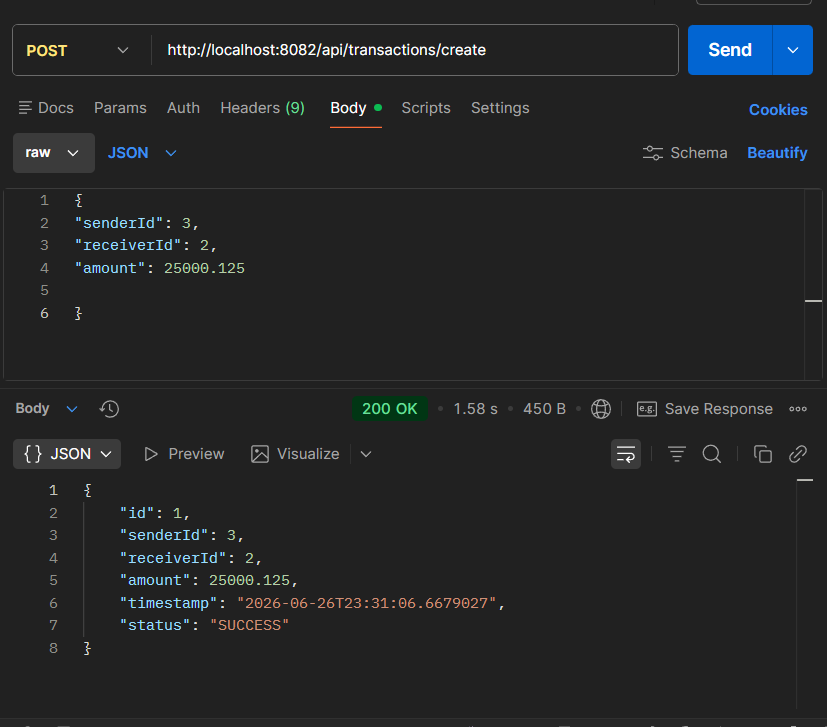
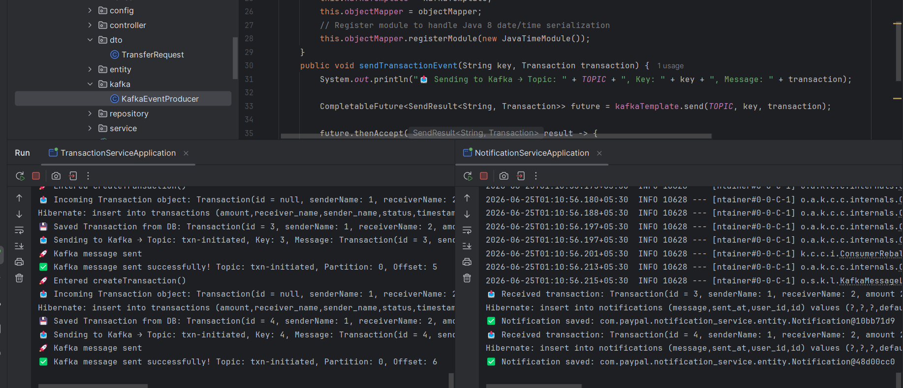
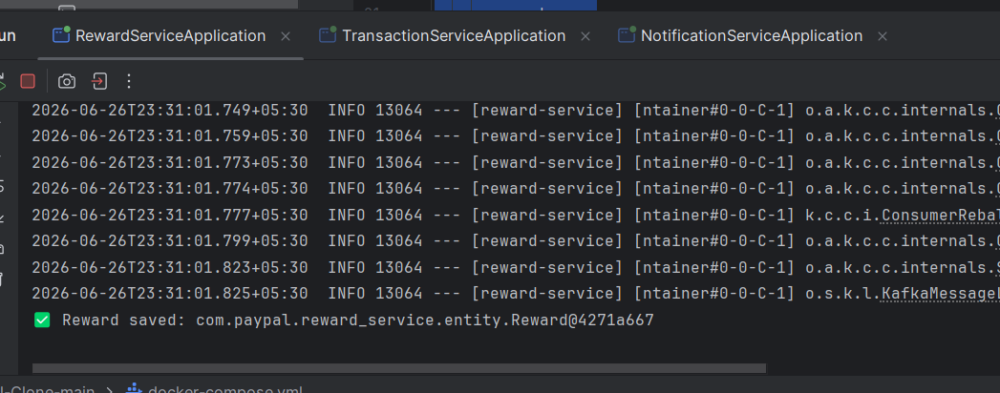
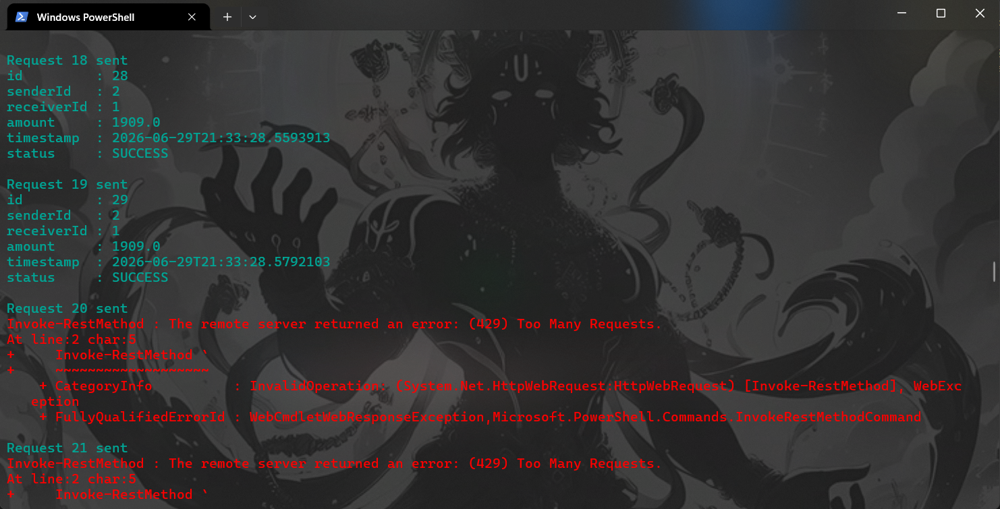

# 💳 PayPal Clone — Microservices Backend

> A scalable, production-inspired payment platform built with Spring Boot microservices architecture.


---

## 📌 Project Status

> **Stage 5 — API Gateway with JWT Auth & Rate Limiting (Complete)**
> This project is under active development. The README is updated alongside each development stage.

| Stage | Milestone | Status |
|-------|-----------|--------|
| 1 | User Service (CRUD + Security Setup) | ✅ Complete |
| 2 | JWT Authentication & Authorization | ✅ Complete |
| 3 | Transaction Service | ✅ Complete |
| 4 | Notification Service + Reward Service (Kafka Event-Driven Messaging) | ✅ Complete |
| 5 | API Gateway (routing + JWT auth + Redis rate limiting) | ✅ Complete |
| 6 | Wallet & Balance Management | 🔜 Upcoming |
| 7 | Docker & Kubernetes Deployment | 🔜 Upcoming |

---

## Table of Contents

1. [Overview](#1-overview)
2. [Current Microservices](#2-current-microservices)
3. [Kafka-Based Event-Driven Microservices](#3-kafka-based-event-driven-microservices-stage-4)
4. [API Gateway](#4-api-gateway-stage-5)
5. [Architecture](#5-architecture)
6. [Tech Stack](#6-tech-stack)
7. [Folder Structure](#7-folder-structure)
8. [How to Run](#8-how-to-run)
9. [API Endpoints](#9-api-endpoints)
10. [Screenshots](#10-screenshots)
11. [Planned Microservices](#11-planned-microservices)
12. [Contributors](#12-contributors)

---

## 1. Overview

A backend system inspired by PayPal, designed to demonstrate real-world **microservices architecture** using Spring Boot. The platform handles user management, JWT-based authentication, and financial transactions — built with scalability, security, and clean design as core principles.

Each service is independently deployable, loosely coupled, and communicates over REST for synchronous flows and **Apache Kafka** for asynchronous, event-driven communication (e.g. transaction → notification/reward events). All client traffic now enters through a central **API Gateway**, which routes requests to the appropriate downstream service.

---

## 2. Current Microservices

### 👤 User Service *(Stage 1 & 2)*

Handles core user lifecycle management and authentication.

**Stage 1 Features:**
- Create a new user
- Fetch user by ID
- Fetch all users
- Update user details
- Custom exception handling for cleaner error responses
- Spring Security configuration (foundation for JWT)

**Stage 2 Features:**
- Signup API with BCrypt password hashing
- Login API with JWT token generation
- JWT request filter for stateless authentication
- Role-based claims inside JWT payload
- Spring Security context population per request
- Stateless session management

---

### 💸 Transaction Service *(Stage 3 — Complete)*

Handles the creation and persistence of financial transactions between users.

**Stage 3 Features:**
- `Transaction` entity with fields: `id`, `senderId`, `receiverId`, `amount`, `timestamp`, `status`
- JPA annotations: `@Entity`, `@Table`, `@Id`, `@GeneratedValue`, `@Column`
- Amount validation using `@Positive` with Spring Validation dependency
- Automatic `timestamp` population via `@PrePersist` using `LocalDateTime.now()`
- Default `status` set to `"PENDING"` on pre-persist
- `POST /api/transactions/create` endpoint — creates and persists a transaction, returns full transaction object
- Clean column naming (`sender_id`, `receiver_id`) to accurately reflect stored data
- Hibernate/H2 debugging — traced and fixed `NULL not allowed` constraint violations caused by incorrect getter/setter naming and JSON mapping issues

---

### 📣 Notification Service *(Stage 4 — Complete)*

Consumes transaction events asynchronously and generates notifications, decoupled from the Transaction Service via Kafka.

**Stage 4 Features:**
- Apache Kafka integration for event-driven communication between Transaction Service and Notification Service
- `KafkaEventProducer` in Transaction Service publishes transaction events to the `txn-initiated` topic after successful transaction creation
- `NotificationConsumer` in Notification Service listens to `txn-initiated` via `@KafkaListener` (`groupId: notification-group`)
- Transaction events are automatically deserialized into `Transaction` objects on consumption
- Notifications are generated and persisted using Spring Data JPA + H2 whenever a transaction completes
- Logging added for Kafka publish confirmation and consumption tracking
- Kafka and Zookeeper containerized via Docker Compose for local development

---

### 🎁 Reward Service *(Stage 4 — Complete)*

A second independent consumer of transaction events, implemented by following [this Spring Kafka microservices tutorial](https://www.youtube.com/watch?v=yDW3YvgfkoY&list=PLaihB5c0gLqZNjSIGHak3Fg_o-Sp1V_IU&index=8&t=6s). Awards a reward record for every completed transaction, fully decoupled from both the Transaction and Notification services.

**Stage 4 Features:**
- `RewardServiceApplication` runs as its own Spring Boot service, consuming from the same `txn-initiated` Kafka topic
- Dedicated `@KafkaListener` (separate consumer group) deserializes incoming `Transaction` events
- `Reward` entity persisted via Spring Data JPA + H2 on successful event consumption
- Verified end-to-end: a transaction created via Postman triggers Kafka delivery, with service logs confirming `Reward saved: com.paypal.reward_service.entity.Reward@...`
- Demonstrates Kafka's pub-sub model — both Notification Service and Reward Service independently consume the same event stream without coupling to each other

---

### 🚪 API Gateway *(Stage 5 — Complete)*

A single entry point that routes all client requests to the appropriate downstream microservice, built by following [this Spring Cloud Gateway tutorial](https://www.youtube.com/watch?v=e02QT3UGsHE&list=PLaihB5c0gLqZNjSIGHak3Fg_o-Sp1V_IU&index=10&t=1534s).

**Stage 5 Features:**
- Spring Cloud Gateway configured as the single entry point for all client traffic
- Route definitions mapping incoming paths to User Service, Transaction Service, Notification Service, and Reward Service
- Clients now hit the Gateway port instead of calling each service directly
- Verified routing works end-to-end across all downstream services
- **Centralized JWT authentication** — `JwtAuthFilter` validates the token on every incoming request *before* it's routed downstream, with `JwtUtil` handling token parsing/validation logic
- Unauthenticated or invalid-token requests are rejected at the Gateway, so downstream services no longer need to repeat JWT checks
- **Redis-backed rate limiting** — every route (`user-service`, `transaction-service`, `reward-service`, `notification-service`) is protected by Spring Cloud Gateway's `RequestRateLimiter` filter, backed by Redis
- Custom `KeyResolver` (`userKeyResolver`) rate-limits per authenticated user via the `X-User-Id` header, falling back to client IP address when the header is absent
- Verified end-to-end: rapid-fire requests succeed until the configured burst capacity, then receive `429 Too Many Requests` from the Gateway

---

## 3. Kafka-Based Event-Driven Microservices *(Stage 4)*

Implemented asynchronous, pub-sub communication from the Transaction Service to two independent downstream consumers — Notification Service and Reward Service — using Apache Kafka.

### Features

- Transaction Service publishes transaction events to a single Kafka topic (`txn-initiated`)
- **Notification Service** consumes events via `@KafkaListener` (`notification-group`) and persists a notification record
- **Reward Service** independently consumes the *same* topic via its own consumer group and persists a reward record
- Transaction details are automatically deserialized into a `Transaction` object on each consumer
- Decoupled microservice communication using event-driven architecture — neither consumer is aware of the other

### Components Added

**Transaction Service**
- Configured Kafka Producer using Spring Kafka
- Created `KafkaEventProducer` to publish transaction events
- Published transaction details after successful transaction creation
- Added logging for Kafka event publishing and delivery confirmation

**Notification Service**
- Configured Kafka Consumer using Spring Kafka
- Created `NotificationConsumer` with `@KafkaListener`
- Consumes events from the `txn-initiated` topic
- Generates notification messages automatically
- Persists notifications using Spring Data JPA and H2 Database

**Reward Service**
- Configured as an independent Spring Boot microservice with its own Kafka consumer
- Consumes the same `txn-initiated` topic with a dedicated consumer group
- Persists a `Reward` entity for every transaction event received
- Built by following an external Spring Kafka microservices tutorial, adapted to this project's `Transaction` event schema

### Kafka Configuration

**Producer**
```java
kafkaTemplate.send("txn-initiated", transaction);
```

**Consumer**
```java
@KafkaListener(
    topics = "txn-initiated",
    groupId = "notification-group"
)
public void consumeTransaction(Transaction transaction)
```

### Event Flow

```
Client Request
      ↓
Transaction Service
      ↓
Save Transaction
      ↓
Publish Event to Kafka Topic (txn-initiated)
      ↓
Kafka Broker
      ↓
      ├──→ Notification Service Consumer → Generate Notification → Save Notification
      │
      └──→ Reward Service Consumer       → Generate Reward       → Save Reward
```

### Docker Setup

Kafka and Zookeeper were containerized using Docker Compose.

```yaml
services:
  zookeeper:
    image: confluentinc/cp-zookeeper:7.4.1

  kafka:
    image: confluentinc/cp-kafka:7.4.1
```

Started using:

```bash
docker compose up -d
```

### Verification

**Transaction Creation**

A transaction was successfully created through the Transaction Service API.

Example request:
```json
{
  "senderId": 3,
  "receiverId": 2,
  "amount": 25000.125
}
```

Example response:
```json
{
  "id": 1,
  "senderId": 3,
  "receiverId": 2,
  "amount": 25000.125,
  "timestamp": "2026-06-26T23:31:06.6679027",
  "status": "SUCCESS"
}
```

**Kafka Event Processing — Notification Service**

Logs confirm:
- Transaction saved successfully
- Event published to Kafka
- Notification Service consumed the event
- Notification persisted in the database

Example logs:
```text
Kafka message sent successfully!
Received transaction: Transaction(id=4,...)
Notification saved successfully
```

**Kafka Event Processing — Reward Service**

The same transaction event was independently consumed by the Reward Service, confirming Kafka's pub-sub fan-out across multiple consumer groups.

Example log:
```text
Reward saved: com.paypal.reward_service.entity.Reward@4271a667
```

---

## 4. API Gateway *(Stage 5)*

A centralized **Spring Cloud Gateway** service was introduced as the single entry point for all client requests, built by following [this tutorial](https://www.youtube.com/watch?v=e02QT3UGsHE&list=PLaihB5c0gLqZNjSIGHak3Fg_o-Sp1V_IU&index=10&t=1534s).

### Features

- All incoming client requests now route through the Gateway instead of hitting individual services directly
- Route definitions map URL paths to the correct downstream microservice (User, Transaction, Notification, Reward)
- **Centralized JWT authentication** — `JwtAuthFilter` intercepts every request at the Gateway and validates the JWT via `JwtUtil` *before* forwarding it downstream
- Requests with a missing or invalid token are rejected at the Gateway itself, so downstream services no longer duplicate auth logic
- **Redis-backed rate limiting** on every route via Spring Cloud Gateway's `RequestRateLimiter` filter
- Custom `KeyResolver` rate-limits per user (`X-User-Id` header) with IP-address fallback
- `DedupeResponseHeader` default filter applied globally to clean up duplicate CORS headers across routes

### Gateway-Level JWT Authentication

```
Incoming Request
      ↓
JwtAuthFilter (Gateway)
      ↓
Extract token from Authorization header
      ↓
JwtUtil → Validate signature & expiry
      ↓
   ┌──────────────┴──────────────┐
   ↓                              ↓
Valid token                  Invalid / missing token
   ↓                              ↓
Forward to downstream         401 Unauthorized
service via route             (request blocked at Gateway)
```

Components:
- `filters/JwtAuthFilter` — Spring Cloud Gateway global/route filter that runs on every request
- `util/JwtUtil` — shared token parsing & validation logic (signature check, expiry check)

### Redis-Backed Rate Limiting

Every route is protected by Spring Cloud Gateway's built-in `RequestRateLimiter` filter, backed by Redis (`spring-boot-starter-data-redis-reactive` + Lettuce).

> 🐳 Unlike Kafka/Zookeeper (which run via `docker-compose.yml`), Redis runs as a **standalone container**, started separately:
> ```bash
> docker run -d -p 6379:6379 --name redis redis:alpine
> ```
> Verified with `docker exec redis redis-cli ping` → `PONG`

**Configuration (applied per route):**
```yaml
filters:
  - name: RequestRateLimiter
    args:
      key-resolver: "#{@userKeyResolver}"
      redis-rate-limiter.replenishRate: 10
      redis-rate-limiter.burstCapacity: 20
      redis-rate-limiter.requestedTokens: 1
```

- **replenishRate: 10** — steady-state tokens refilled per second
- **burstCapacity: 20** — max tokens (requests) allowed in a burst before throttling kicks in
- **requestedTokens: 1** — tokens consumed per request

**Custom Key Resolver:**
```java
@Bean
public KeyResolver userKeyResolver(){
    return exchange -> {
        String userId = exchange.getRequest().getHeaders().getFirst("X-User-Id");
        if (userId != null) {
            return Mono.just(userId);
        }
        // fallback via IP Address
        return Mono.just(exchange.getRequest().getRemoteAddress().getAddress().getHostAddress());
    };
}
```

Rate limiting is keyed per user (via `X-User-Id`) so one user's traffic can't exhaust another user's quota; if the header is missing, it falls back to limiting per client IP.

**Verification:**

A PowerShell script fired rapid sequential requests against the Transaction Service through the Gateway. Requests succeeded normally up through request #19, then request #20 onward returned `429 Too Many Requests`, confirming the burst capacity (20) and rate limiter were working as configured.

### Routing Flow

```
Client Request
      ↓
API Gateway :8080 (single entry point)
      ↓
JwtAuthFilter → validate token (see above)
      ↓ (valid)
      ↓
RequestRateLimiter → check Redis token bucket (see above)
      ↓ (under limit)
      ├──→ /auth/**              → User Service          (localhost:8081)
      ├──→ /api/transactions/**  → Transaction Service    (localhost:8082)
      ├──→ /api/notifications/** → Notification Service   (localhost:8084)
      └──→ /api/rewards/**       → Reward Service          (localhost:8085)
```

> Note: `/auth/signup` and `/auth/login` are excluded from JWT validation at the Gateway, since users don't have a token yet at that point. All four routes — User, Transaction, Notification, and Reward — are rate-limited identically via the shared `userKeyResolver`.

### What's Next for Stage 5

- [x] Routing to all downstream services
- [x] Centralized JWT authentication
- [x] Redis-backed rate limiting
- [ ] Add Eureka-based service discovery so routes don't need hardcoded service URLs

---

## 5. Architecture

### JWT Authentication Flow

```
Signup → Store User (BCrypt password)
Login  → Validate credentials → Generate JWT
       → Send JWT in Authorization header
       → JWTRequestFilter validates token
       → Populate SecurityContext
       → Access protected endpoints
```

### Transaction Flow *(Stage 3)*

```
POST /api/transactions/create
       ↓
TransactionController
       ↓
TransactionService       → Validates input (amount > 0)
       ↓
@PrePersist              → Sets timestamp = now(), status = "PENDING"
       ↓
TransactionRepository    → Persists to H2 (MySQL in later stage)
       ↓
Response: { id, senderId, receiverId, amount, timestamp, status }
```

### Layered Architecture (Per Service)

```
Client Request
     ↓
Controller Layer      → Handles HTTP requests & responses
     ↓
Service Layer         → Business logic
     ↓
Repository Layer      → Database operations (Spring Data JPA)
     ↓
Database (H2 / MySQL) → Persistence
```

### System Architecture *(Evolves Each Stage)*

```
[Clients]
    ↓
[API Gateway] ← Stage 5 ✅ (routing + JWT auth + Redis rate limiting)
    ↓
┌─────────────────────────────────┐
│  User Service     ← Stage 1 ✅  │
│  Auth (JWT)       ← Stage 2 ✅  │
│  Transaction Svc  ← Stage 3 ✅  │
│  Notification Svc ← Stage 4 ✅  │
│  Reward Svc       ← Stage 4 ✅  │
│  Wallet Service   ← Stage 6     │
└─────────────────────────────────┘
    ↓
[Message Broker - Apache Kafka] ← Stage 4 ✅
[Redis - Rate Limiting Store]   ← Stage 5 ✅
```

---

## 6. Tech Stack

| Technology | Purpose | Status |
|------------|---------|--------|
| Java 17+ | Core language | ✅ Active |
| Spring Boot 3.x | Application framework | ✅ Active |
| Spring Data JPA | ORM & database operations | ✅ Active |
| Spring Security | Auth & authorization | ✅ Active |
| JJWT 0.12.x | JWT generation & validation | ✅ Active |
| Spring Validation | Request validation (`@Positive`, etc.) | ✅ Active |
| Spring Kafka | Event-driven messaging (producer/consumer) — used by Notification Service & Reward Service | ✅ Active |
| Apache Kafka | Async message broker | ✅ Active |
| Zookeeper | Kafka cluster coordination | ✅ Active |
| Spring Cloud Gateway | API Gateway — centralized routing + JWT auth filter | ✅ Active |
| Redis (Spring Data Redis Reactive + Lettuce) | Rate limiter token bucket store | ✅ Active |
| Docker Compose | Local Kafka/Zookeeper orchestration | ✅ Active |
| Docker (standalone container) | Local Redis instance for rate limiting | ✅ Active |
| H2 Database | In-memory DB (dev) | ✅ Active |
| BCrypt | Password hashing | ✅ Active |
| MySQL / PostgreSQL | Production DB | 🔜 Upcoming |
| Maven | Build tool | ✅ Active |
| Eureka | Service discovery | 🔜 Stage 5 |
| Kubernetes | Orchestration | 🔜 Stage 7 |

---

## 7. Folder Structure

```
paypal-clone/
│
├── assets/                            # Screenshots
│
├── docker-compose.yml                 # Kafka + Zookeeper setup ← Stage 4
│
├── api-gateway/                       ← Stage 5
│   ├── src/
│   │   ├── main/
│   │   │   ├── java/com/paypal/api_gateway/
│   │   │   │   ├── config/            # RateLimitConfig (KeyResolver bean)
│   │   │   │   ├── filters/           # JwtAuthFilter
│   │   │   │   └── util/              # JwtUtil
│   │   │   └── resources/
│   │   │       └── application.yml    # Route, JWT & rate-limiter definitions
│   │   └── test/
│   └── pom.xml
│
├── user-service/
│   ├── src/
│   │   ├── main/
│   │   │   ├── java/com/paypal/user_service/
│   │   │   │   ├── controller/        # AuthController, UserController
│   │   │   │   ├── dto/               # JwtResponse, LoginRequest, SignupRequest
│   │   │   │   ├── entity/            # User
│   │   │   │   ├── repository/        # UserRepository
│   │   │   │   ├── security/          # SecurityConfig
│   │   │   │   ├── service/           # UserService, UserServiceImpl
│   │   │   │   └── util/              # JWTUtil, JWTRequestFilter
│   │   │   └── resources/
│   │   │       └── application.properties
│   │   └── test/
│   └── pom.xml
│
├── transaction-service/
│   ├── src/
│   │   ├── main/
│   │   │   ├── java/com/paypal/transaction_service/
│   │   │   │   ├── controller/        # TransactionController
│   │   │   │   ├── entity/            # Transaction
│   │   │   │   ├── kafka/             # KafkaEventProducer ← Stage 4
│   │   │   │   ├── repository/        # TransactionRepository
│   │   │   │   └── service/           # TransactionService, TransactionServiceImpl
│   │   │   └── resources/
│   │   │       └── application.properties
│   │   └── test/
│   └── pom.xml
│
├── notification-service/              ← Stage 4
│   ├── src/
│   │   ├── main/
│   │   │   ├── java/com/paypal/notification_service/
│   │   │   │   ├── consumer/          # NotificationConsumer
│   │   │   │   ├── entity/            # Notification
│   │   │   │   ├── repository/        # NotificationRepository
│   │   │   │   └── service/           # NotificationService, NotificationServiceImpl
│   │   │   └── resources/
│   │   │       └── application.properties
│   │   └── test/
│   └── pom.xml
│
├── reward-service/                    ← Stage 4
│   ├── src/
│   │   ├── main/
│   │   │   ├── java/com/paypal/reward_service/
│   │   │   │   ├── consumer/          # RewardConsumer
│   │   │   │   ├── entity/            # Reward
│   │   │   │   ├── repository/        # RewardRepository
│   │   │   │   └── service/           # RewardService, RewardServiceImpl
│   │   │   └── resources/
│   │   │       └── application.properties
│   │   └── test/
│   └── pom.xml
│
└── README.md
```

> 📁 Additional service folders will be added as the project progresses through each stage.

---

## 8. How to Run

### Prerequisites

- Java 17+
- Maven 3.8+
- Docker (for Kafka + Zookeeper via Docker Compose, and Redis as a standalone container)

### Step 1 — Clone Repository

```bash
git clone https://github.com/ishant212/paypal-clone
cd paypal-clone
```

### Step 2 — Start Kafka & Zookeeper

```bash
docker compose up -d
```

### Step 3 — Start Redis

Redis runs as a standalone container (not part of `docker-compose.yml`):

```bash
docker run -d -p 6379:6379 --name redis redis:alpine
```

Verify it's up:

```bash
docker exec redis redis-cli ping
```

Expected output: `PONG`

### Step 4 — Navigate to a Service

```bash
cd api-gateway
# or
cd user-service
# or
cd transaction-service
# or
cd notification-service
# or
cd reward-service
```

### Step 5 — Build & Run

```bash
mvn spring-boot:run
```

> 💡 Start the downstream services first, then the **api-gateway** last, so its routes have something to forward to. Once running, send requests to the Gateway's port instead of each service's individual port.

### Step 6 — Access H2 Console *(Optional)*

```
URL:      http://localhost:8080/h2-console
JDBC URL: jdbc:h2:mem:testdb
Username: sa
Password: (leave blank)
```

> ⚠️ H2 is an in-memory database used for development. Data resets on restart. MySQL/PostgreSQL will be integrated in a later stage.

---

## 9. API Endpoints

> 🚪 **All endpoints below are now reachable through the API Gateway**, which routes to the underlying service. The Gateway itself enforces JWT authentication via `JwtAuthFilter` — requests to protected routes without a valid token are rejected at the Gateway before reaching the service. Direct service ports still work too, but the Gateway is the intended single entry point going forward.

### Auth — Base URL: `/auth`

| Method | Endpoint | Description | Auth Required |
|--------|----------|-------------|---------------|
| `POST` | `/auth/signup` | Register a new user | ❌ |
| `POST` | `/auth/login` | Login and receive JWT | ❌ |

### Sample Request — Signup

```json
POST /auth/signup
Content-Type: application/json

{
  "name": "Ishant Shekhar",
  "email": "ishant@example.com",
  "password": "securepassword"
}
```

### Sample Response — Signup

```
User Registration successful
```

### Sample Request — Login

```json
POST /auth/login
Content-Type: application/json

{
  "email": "ishant@example.com",
  "password": "securepassword"
}
```

### Sample Response — Login

```json
{
  "token": "eyJhbGciOiJIUzI1NiJ9.eyJyb2xlIjoiUk9MRV9VU0VSIiwic3ViIjoiaXNoYW50QGV4YW1wbGUuY29tIn0..."
}
```

> Use the returned token as `Authorization: Bearer <token>` in subsequent requests to protected endpoints.

---

### User Service — Base URL: `/api/users`

| Method | Endpoint | Description | Auth Required |
|--------|----------|-------------|---------------|
| `POST` | `/api/users` | Create a new user | ❌ |
| `GET` | `/api/users/{id}` | Fetch user by ID | ✅ |
| `GET` | `/api/users` | Fetch all users | ✅ |

### Sample Request — Create User

```json
POST /api/users
Content-Type: application/json

{
  "name": "Ishant Shekhar",
  "email": "ishant@example.com",
  "password": "securepassword"
}
```

### Sample Response — Create User

```json
{
  "id": 1,
  "name": "Ishant Shekhar",
  "email": "ishant@example.com",
  "createdAt": "2025-01-01T10:00:00"
}
```

---

### Transaction Service — Base URL: `/api/transactions`

| Method | Endpoint | Description | Auth Required |
|--------|----------|-------------|---------------|
| `POST` | `/api/transactions/create` | Create a new transaction (publishes Kafka event on success) | ✅ |

### Sample Request — Create Transaction

```json
POST /api/transactions/create
Content-Type: application/json

{
  "senderId": 1,
  "receiverId": 2,
  "amount": 140.12
}
```

### Sample Response — Create Transaction

```json
{
  "id": 1,
  "senderId": 1,
  "receiverId": 2,
  "amount": 140.12,
  "timestamp": "2026-05-21T09:43:31.8732542",
  "status": "SUCCESS"
}
```

> 📋 Full API documentation (Swagger/OpenAPI) will be added in a future stage.

---

### Notification Service — Base URL: `/api/notifications` *(Stage 4/5)*

| Method | Endpoint | Description | Auth Required |
|--------|----------|-------------|---------------|
| — | `/api/notifications/**` | Routed through the Gateway (rate-limited); primary role is still as a Kafka consumer on `txn-initiated` | ✅ |

> The Notification Service is primarily event-driven (Kafka consumer), but its route is also registered at the Gateway for future REST endpoints (e.g. fetching notification history).

---

### Reward Service — Base URL: `/api/rewards` *(Stage 4/5)*

| Method | Endpoint | Description | Auth Required |
|--------|----------|-------------|---------------|
| — | `/api/rewards/**` | Routed through the Gateway (rate-limited); primary role is still as a Kafka consumer on `txn-initiated` | ✅ |

> The Reward Service is primarily event-driven (Kafka consumer), but its route is also registered at the Gateway for future REST endpoints (e.g. fetching reward history).

---

## 10. Screenshots

### 🟢 Signup — POST `/auth/signup`


### 🔵 Login — POST `/auth/login`


### 🟢 Create User — POST `/api/users`


### 🔵 Fetch User by ID — GET `/api/users/{id}`


### 🟡 Fetch All Users — GET `/api/users`


### 🟢 Create Transaction — POST `/api/transactions/create`


### 📨 Kafka Event Processing — Transaction → Notification


### 🎁 Kafka Event Processing — Transaction → Reward


### 🚦 Gateway Rate Limiting — 429 Too Many Requests


> 📸 Screenshots captured using Postman and IDE run logs. More will be added with each new feature.

---

## 11. Planned Microservices

| Service / Feature | Responsibility |
|---------|---------------|
| Wallet Service | Balance management, top-up |
| Service Discovery (Eureka) | Dynamic service registration & lookup |

---  
> ⭐ This project is being built stage by stage as a portfolio demonstration of real-world microservices design. Star it to follow along!
