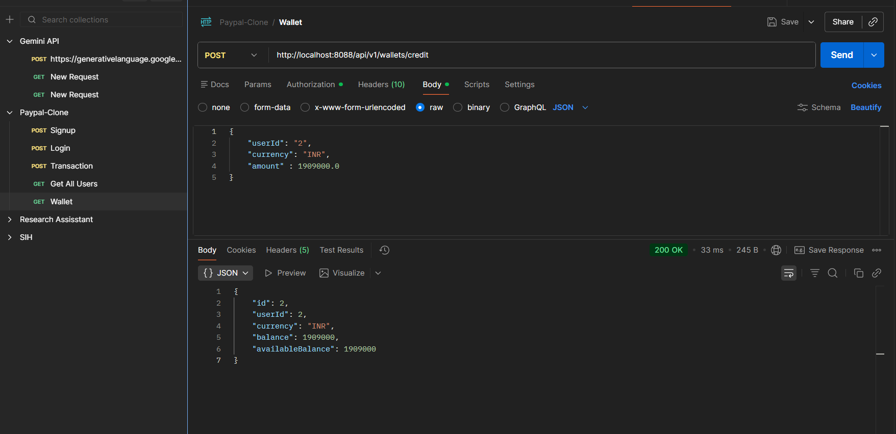
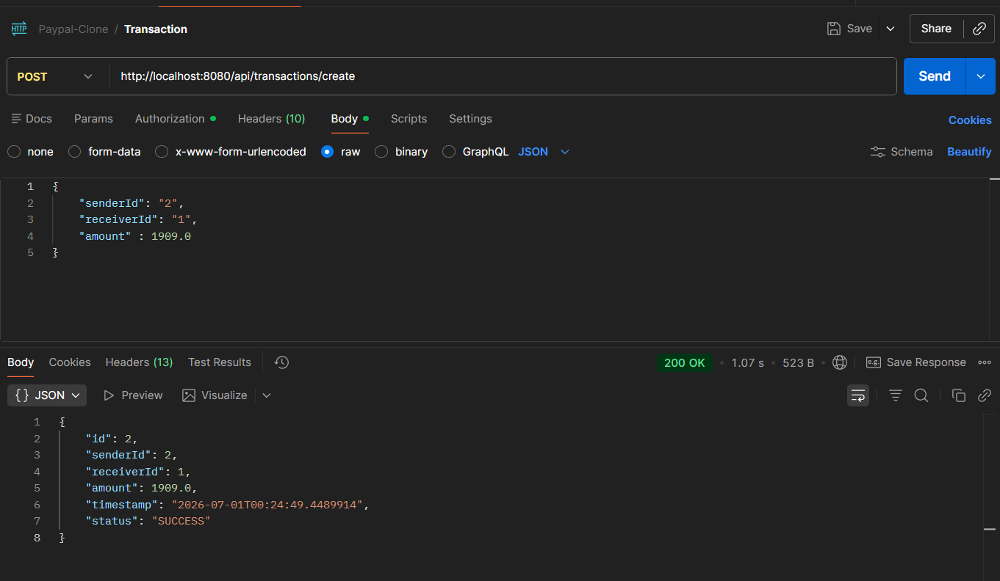
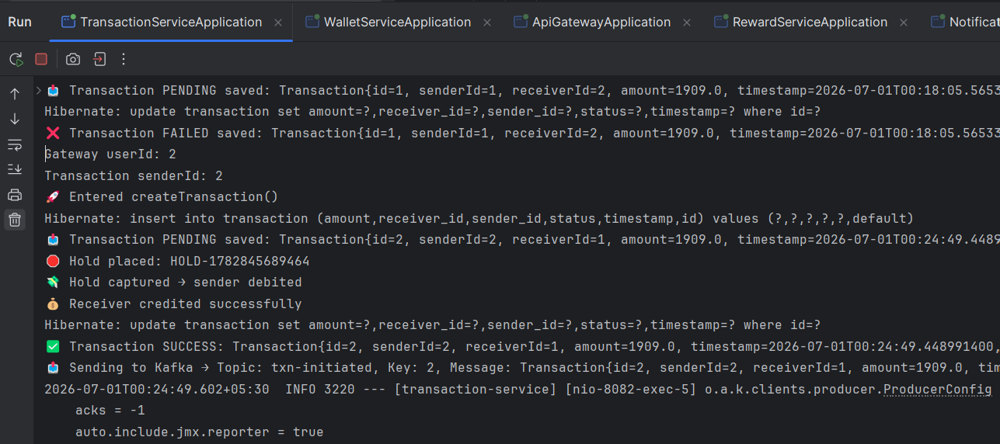
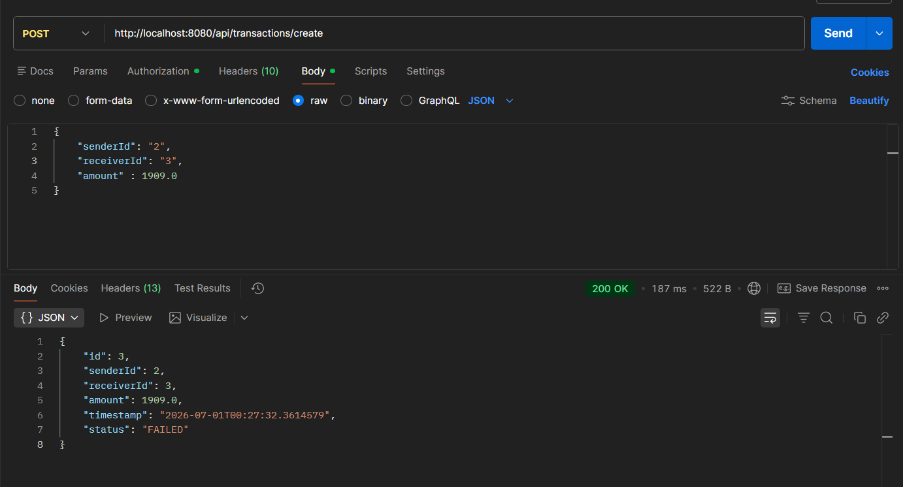
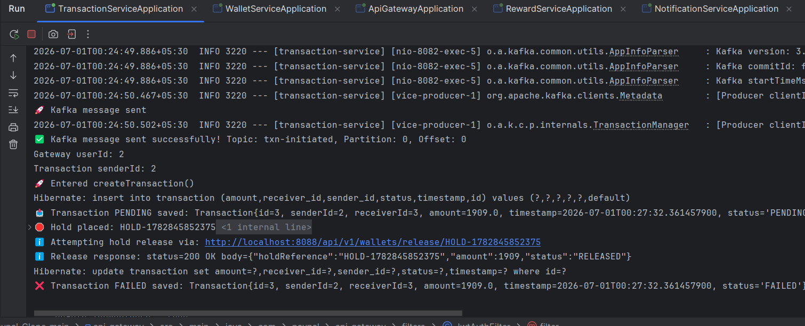

# 💳 PayPal Clone — Microservices Backend

> A scalable, production-inspired payment platform built with Spring Boot microservices architecture.


---

## 📌 Project Status

> ✅ **Backend feature-complete (for now)** — all core microservices are built and wired end-to-end, including real fund movement through the Wallet Service. Stage 7 (Docker/Kubernetes deployment) is the next milestone whenever this project is picked back up.

| Stage | Milestone | Status |
|-------|-----------|--------|
| 1 | User Service (CRUD + Security Setup) | ✅ Complete |
| 2 | JWT Authentication & Authorization | ✅ Complete |
| 3 | Transaction Service | ✅ Complete |
| 4 | Notification Service + Reward Service (Kafka Event-Driven Messaging) | ✅ Complete |
| 5 | API Gateway (routing + JWT auth + Redis rate limiting) | ✅ Complete |
| 6 | Wallet Service (balance, credit/debit, holds) + Transaction integration | ✅ Complete |
| 7 | Docker & Kubernetes Deployment | 🔜 Upcoming |

---

## Table of Contents

1. [Overview](#1-overview)
2. [Current Microservices](#2-current-microservices)
3. [Kafka-Based Event-Driven Microservices](#3-kafka-based-event-driven-microservices-stage-4)
4. [API Gateway](#4-api-gateway-stage-5)
5. [Architecture](#5-architecture)
6. [Tech Stack](#6-tech-stack)
7. [Folder Structure](#7-folder-structure)
8. [How to Run](#8-how-to-run)
9. [API Endpoints](#9-api-endpoints)
10. [Screenshots](#10-screenshots)
11. [Future Enhancements](#11-future-enhancements)
12. [Contributors](#12-contributors)

---

## 1. Overview

A backend system inspired by PayPal, demonstrating real-world **microservices architecture** using Spring Boot — user management, JWT auth, transactions, wallets, and event-driven notifications/rewards.

Each service is independently deployable and loosely coupled. Communication is synchronous REST for direct calls (e.g. Transaction Service → Wallet Service for fund movement) and **Apache Kafka** for async events (transaction → notification/reward). All client traffic enters through a central **API Gateway**, which handles JWT auth and rate limiting before routing downstream.

---

## 2. Current Microservices

### 👤 User Service *(Stage 1 & 2 — Complete)*

- CRUD endpoints (create, fetch by ID, fetch all, update) with custom exception handling
- Signup with BCrypt password hashing, login with JWT generation
- Stateless auth via `JWTRequestFilter` + Spring Security context, role-based claims in the token

---

### 💸 Transaction Service *(Stage 3 — Complete)*

Creates and persists transactions between users — now synchronously backed by the **Wallet Service** for real fund movement instead of just recording a status.

- `Transaction` entity (`senderId`, `receiverId`, `amount`, `timestamp`, `status`) with `@Positive` amount validation and auto-populated timestamp/status on `@PrePersist`
- `POST /api/transactions/create` saves the transaction as `PENDING`, then calls `WalletClient` to **hold** funds on the sender's wallet
- On success the hold is **captured** (sender debited, receiver credited) and the transaction is marked `SUCCESS`; on any failure (e.g. an invalid receiver) the hold is **released** and the transaction is marked `FAILED`
- Publishes a Kafka event on the final outcome for Notification/Reward services to consume

---

### 📣 Notification Service *(Stage 4 — Complete)*

- `NotificationConsumer` listens to the `txn-initiated` topic (`groupId: notification-group`)
- Deserializes events into `Transaction` objects and persists a notification via Spring Data JPA + H2
- Runs alongside Kafka/Zookeeper, containerized via Docker Compose

---

### 🎁 Reward Service *(Stage 4 — Complete)*

Built by following [this Spring Kafka microservices tutorial](https://www.youtube.com/watch?v=yDW3YvgfkoY&list=PLaihB5c0gLqZNjSIGHak3Fg_o-Sp1V_IU&index=8&t=6s).

- Own `@KafkaListener` + consumer group on `txn-initiated`, fully decoupled from the Notification Service
- Persists a `Reward` entity for every completed transaction via Spring Data JPA + H2
- Verified end-to-end: a Postman-triggered transaction produces a logged `Reward saved: ...` entry

---

### 🚪 API Gateway *(Stage 5 — Complete)*

Single entry point for all client traffic, built by following [this Spring Cloud Gateway tutorial](https://www.youtube.com/watch?v=e02QT3UGsHE&list=PLaihB5c0gLqZNjSIGHak3Fg_o-Sp1V_IU&index=10&t=1534s).

- Routes requests to User, Transaction, Notification, and Reward services
- **Centralized JWT auth** via `JwtAuthFilter` + `JwtUtil` — invalid/missing tokens are rejected before reaching downstream services (`/auth/signup`, `/auth/login` excluded)
- **Redis-backed rate limiting** via `RequestRateLimiter`, keyed per user (`X-User-Id`) with IP fallback through a custom `KeyResolver`
- Verified: rapid-fire requests succeed up to the configured burst capacity, then return `429 Too Many Requests`

---

### 👛 Wallet Service *(Stage 6 — Complete)*

Manages user balances and now sits in the critical path of every transaction.

- Wallet entity: `userId`, `currency`, `balance`, `availableBalance`
- `POST /api/v1/wallets`, `/credit`, `/debit`, `GET /{userId}` for direct wallet management
- **Hold → capture/release flow**: `POST /hold` reserves funds (`availableBalance` reduced), `POST /capture` finalizes a hold (deducts `balance`), `POST /release/{holdReference}` cancels a hold and restores `availableBalance`
- `HoldExpiryScheduler` auto-expires stale holds; custom `InsufficientFundsException` / `NotFoundException` for clean error handling
- **Integrated with the Transaction Service** via a `WalletClient` REST client + `TransferRequest` DTO — every transaction now places, then captures or releases, a real hold before being marked `SUCCESS`/`FAILED`

---

## 3. Kafka-Based Event-Driven Microservices *(Stage 4)*

Transaction Service publishes one event per transaction to the `txn-initiated` Kafka topic; Notification Service and Reward Service each consume it independently via their own consumer groups, with neither aware of the other.

**Producer**
```java
kafkaTemplate.send("txn-initiated", transaction);
```

**Consumer**
```java
@KafkaListener(topics = "txn-initiated", groupId = "notification-group")
public void consumeTransaction(Transaction transaction)
```

**Event Flow**
```
Transaction Service → Save + Publish → Kafka (txn-initiated)
                                            ├──→ Notification Service → Save Notification
                                            └──→ Reward Service       → Save Reward
```

Kafka & Zookeeper run via Docker Compose (`docker compose up -d`). Verified end-to-end: a transaction created via Postman triggers both consumers, with logs confirming `Notification saved successfully` and `Reward saved: ...` independently.

---

## 4. API Gateway *(Stage 5)*

A centralized **Spring Cloud Gateway** service fronts all client traffic with JWT auth and rate limiting before routing downstream.

**JWT Authentication**
```
Request → JwtAuthFilter → extract + validate token (JwtUtil)
   ├─ valid             → forward to downstream service
   └─ invalid / missing → 401 Unauthorized
```

**Redis-Backed Rate Limiting** — backed by `spring-boot-starter-data-redis-reactive` + Lettuce, run as a standalone container:
```bash
docker run -d -p 6379:6379 --name redis redis:alpine
```

```yaml
filters:
  - name: RequestRateLimiter
    args:
      key-resolver: "#{@userKeyResolver}"
      redis-rate-limiter.replenishRate: 10
      redis-rate-limiter.burstCapacity: 20
      redis-rate-limiter.requestedTokens: 1
```

```java
@Bean
public KeyResolver userKeyResolver(){
    return exchange -> {
        String userId = exchange.getRequest().getHeaders().getFirst("X-User-Id");
        if (userId != null) return Mono.just(userId);
        return Mono.just(exchange.getRequest().getRemoteAddress().getAddress().getHostAddress());
    };
}
```

**Routing**
```
Client → API Gateway :8080 → JwtAuthFilter → RequestRateLimiter
      ├──→ /auth/**              → User Service          (:8081)
      ├──→ /api/transactions/**  → Transaction Service    (:8082)
      ├──→ /api/notifications/** → Notification Service   (:8084)
      └──→ /api/rewards/**       → Reward Service          (:8085)
```
> Wallet Service (`:8088`) is currently called directly — Gateway routing for it is a planned enhancement (see [§11](#11-future-enhancements)).

---

## 5. Architecture

**JWT Authentication Flow**
```
Signup → Store User (BCrypt) → Login → Validate → Issue JWT
       → Authorization: Bearer <token> → JWTRequestFilter validates → SecurityContext populated
```

**Transaction Flow — with Wallet Integration *(Stage 3 & 6)***
```
POST /api/transactions/create
       ↓
Save Transaction → status = PENDING
       ↓
WalletClient → POST /hold (reserve sender's funds)
       ↓
   ┌────────────────┴────────────────┐
   ↓                                   ↓
Hold succeeds                      Hold fails (e.g. invalid receiver)
   ↓                                   ↓
WalletClient → /capture              WalletClient → /release/{holdReference}
(sender debited, receiver credited)        ↓
   ↓                                status = FAILED
status = SUCCESS
   ↓
Publish event → Kafka (txn-initiated)
```

**Layered Architecture (Per Service)**
```
Controller → Service → Repository → Database (H2 / MySQL)
```

**System Architecture**
```
[Clients] → [API Gateway] (JWT + rate limiting)
    ↓
┌───────────────────────────────────┐
│ User • Auth • Transaction          │
│ Notification • Reward • Wallet     │  ← all ✅ complete
└───────────────────────────────────┘
    ↓
[Kafka — async events]      [Redis — rate-limit store]
```

---

## 6. Tech Stack

| Technology | Purpose | Status |
|------------|---------|--------|
| Java 17+ | Core language | ✅ Active |
| Spring Boot 3.x | Application framework | ✅ Active |
| Spring Data JPA | ORM & database operations | ✅ Active |
| Spring Security | Auth & authorization | ✅ Active |
| JJWT 0.12.x | JWT generation & validation | ✅ Active |
| Spring Validation | Request validation (`@Positive`, etc.) | ✅ Active |
| Spring Kafka / Apache Kafka / Zookeeper | Event-driven messaging | ✅ Active |
| Spring Cloud Gateway | Centralized routing + JWT auth filter | ✅ Active |
| Redis (Reactive + Lettuce) | Rate limiter token bucket store | ✅ Active |
| Docker Compose / standalone Docker | Local Kafka/Zookeeper + Redis | ✅ Active |
| H2 Database | In-memory DB (dev) | ✅ Active |
| BCrypt | Password hashing | ✅ Active |
| Maven | Build tool | ✅ Active |
| MySQL / PostgreSQL | Production DB | 🔜 Upcoming |
| Eureka | Service discovery | 🔜 Planned |
| Kubernetes | Orchestration | 🔜 Stage 7 |

---

## 7. Folder Structure

```
paypal-clone/
├── assets/                          # Screenshots — see §10
├── docker-compose.yml                # Kafka + Zookeeper
│
├── api-gateway/
│   └── src/main/java/com/paypal/api_gateway/
│       ├── config/                   # RateLimitConfig (KeyResolver)
│       ├── filters/                  # JwtAuthFilter
│       └── util/                     # JwtUtil
│
├── user-service/
│   └── src/main/java/com/paypal/user_service/
│       └── controller/ dto/ entity/ repository/ security/ service/ util/
│
├── transaction-service/
│   └── src/main/java/com/paypal/transaction_service/
│       ├── client/                   # WalletClient — calls Wallet Service (hold/capture/release)
│       └── controller/ dto/dto/ entity/ kafka/ repository/ service/ util/
│
├── notification-service/
│   └── src/main/java/com/paypal/notification_service/
│       └── consumer/ entity/ repository/ service/
│
├── reward-service/
│   └── src/main/java/com/paypal/reward_service/
│       └── consumer/ entity/ repository/ service/
│
├── wallet-service/
│   └── src/main/java/com/paypal/wallet_service/
│       └── controller/ dto/ entity/ exception/ repository/ scheduler/ service/
│
└── README.md
```
> Each service follows the standard Spring Boot layout (`src/main/resources/application.properties`, `pom.xml`, `src/test`) — omitted above for brevity.

---

## 8. How to Run

**Prerequisites:** Java 17+, Maven 3.8+, Docker

```bash
git clone https://github.com/ishant212/paypal-clone
cd paypal-clone

# Kafka + Zookeeper
docker compose up -d

# Redis (standalone)
docker run -d -p 6379:6379 --name redis redis:alpine
docker exec redis redis-cli ping   # expect: PONG
```

Then, for each service:
```bash
cd <service-folder>   # e.g. wallet-service, user-service, transaction-service, etc.
mvn spring-boot:run
```

> 💡 Start downstream services — **including `wallet-service`** — before `transaction-service`, since it now calls the Wallet Service synchronously. Start `api-gateway` last, then send requests to its port (`:8080`).

**H2 Console** *(optional, per service)*: `http://localhost:8080/h2-console` · JDBC URL `jdbc:h2:mem:testdb` · user `sa` · no password.

---

## 9. API Endpoints

> 🚪 Most endpoints route through the API Gateway, which enforces JWT auth via `JwtAuthFilter`. Wallet Service is the current exception — see note below.

### Auth — `/auth`
| Method | Endpoint | Description | Auth |
|--------|----------|-------------|------|
| `POST` | `/auth/signup` | Register a new user | ❌ |
| `POST` | `/auth/login` | Login, receive JWT | ❌ |

### User Service — `/api/users`
| Method | Endpoint | Description | Auth |
|--------|----------|-------------|------|
| `POST` | `/api/users` | Create a new user | ❌ |
| `GET` | `/api/users/{id}` | Fetch user by ID | ✅ |
| `GET` | `/api/users` | Fetch all users | ✅ |

### Transaction Service — `/api/transactions`
| Method | Endpoint | Description | Auth |
|--------|----------|-------------|------|
| `POST` | `/api/transactions/create` | Create a transaction — holds, then captures/releases funds via Wallet Service, publishes a Kafka event | ✅ |

**Sample request/response**
```json
POST /api/transactions/create
{ "senderId": 2, "receiverId": 1, "amount": 1909.0 }
```
```json
{
  "id": 2,
  "senderId": 2,
  "receiverId": 1,
  "amount": 1909.0,
  "timestamp": "2026-07-01T00:24:49.4489914",
  "status": "SUCCESS"
}
```

### Notification / Reward Services
| Service | Route | Description | Auth |
|---|---|---|---|
| Notification | `/api/notifications/**` | Gateway-routed; primarily a Kafka consumer on `txn-initiated` | ✅ |
| Reward | `/api/rewards/**` | Gateway-routed; primarily a Kafka consumer on `txn-initiated` | ✅ |

### Wallet Service — `http://localhost:8088/api/v1/wallets` *(direct; not yet gateway-routed)*
| Method | Endpoint | Description |
|--------|----------|-------------|
| `POST` | `/api/v1/wallets` | Create wallet |
| `POST` | `/api/v1/wallets/credit` | Credit balance |
| `POST` | `/api/v1/wallets/debit` | Debit balance (fails if insufficient funds) |
| `GET` | `/api/v1/wallets/{userId}` | Fetch wallet |
| `POST` | `/api/v1/wallets/hold` | Reserve funds (hold) |
| `POST` | `/api/v1/wallets/capture` | Finalize a hold |
| `POST` | `/api/v1/wallets/release/{holdReference}` | Cancel a hold, release funds |

---

## 10. Screenshots

### Auth & Users
| Signup | Login | Create User |
|---|---|---|
|  |  |  |

| Fetch User by ID | Fetch All Users |
|---|---|
|  |  |

### Transactions + Wallet
| Credit Wallet — `POST /wallets/credit` | Create Transaction — initial flow |
|---|---|
|  |  |

| Create Transaction — Success (hold → capture) | Transaction Service logs — Success                  |
|---|-----------------------------------------------------|
|  |  |

| Create Transaction — Failed (hold → released) | Transaction Service logs — Failure                                     |
|---|------------------------------------------------------------------------|
|  |  |

### Kafka & Gateway
| Kafka message published | Notification consumed | Reward consumed |
|---|---|---|
|  |  |  |

| Gateway rate limit — `429 Too Many Requests` |
|---|
|  |

---

## 11. Future Enhancements

| Item | Description |
|---|---|
| Service Discovery (Eureka) | Dynamic service registration & lookup instead of hardcoded URLs |
| Stage 7 — Docker & Kubernetes | Containerize and deploy all services |
| Production DB | Swap H2 for MySQL/PostgreSQL |

---

## 12. Contributors

Built and maintained by [Ishant Shekhar Eeshu](https://github.com/ishant212).

---
> ⭐ Core backend (auth, transactions, wallet, async messaging, gateway) is feature-complete. Star the repo to follow along when deployment work (Stage 7) resumes!
