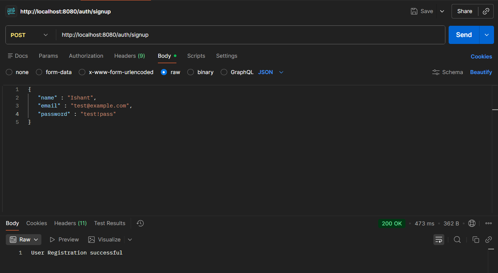
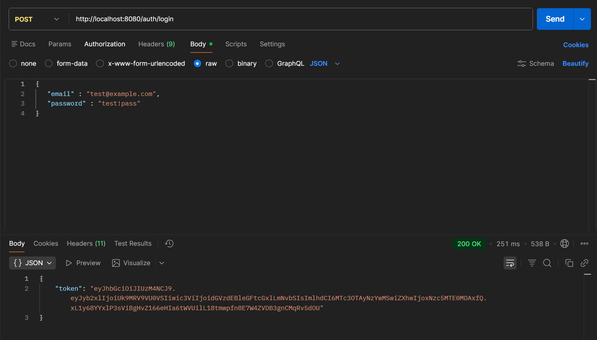
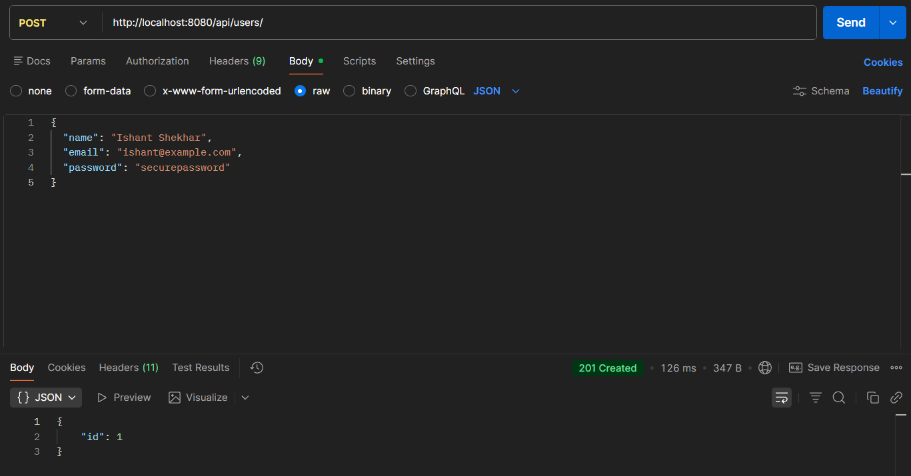
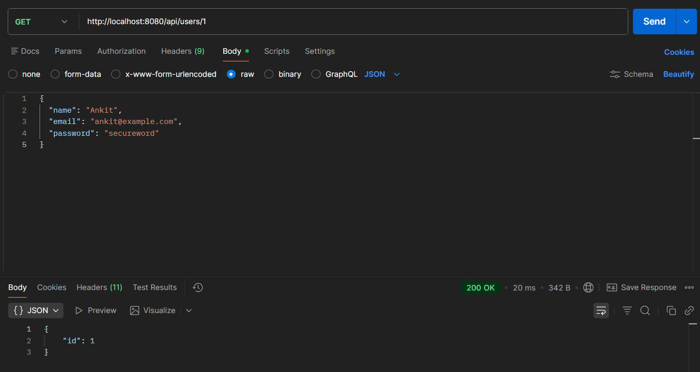
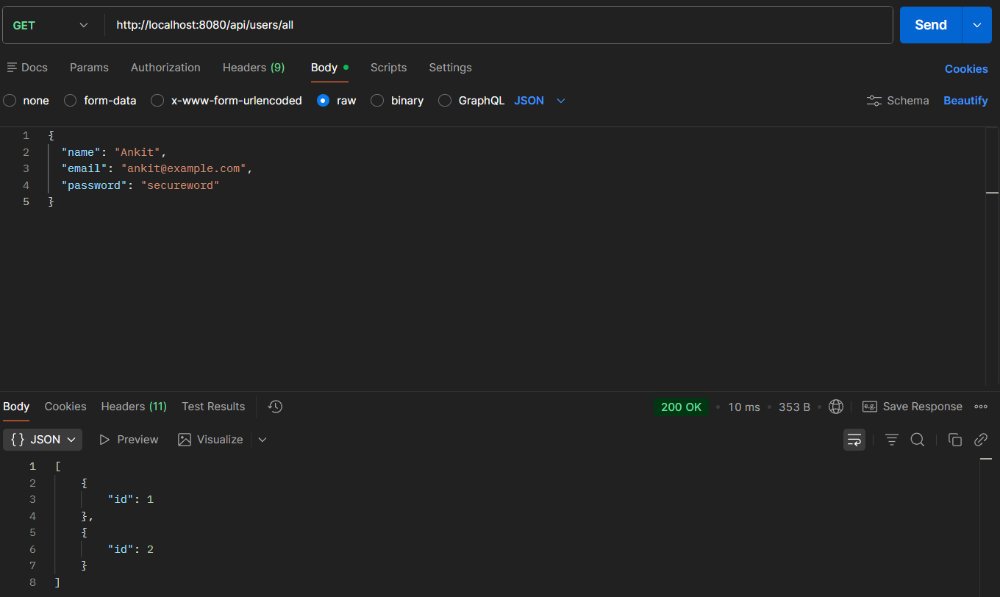
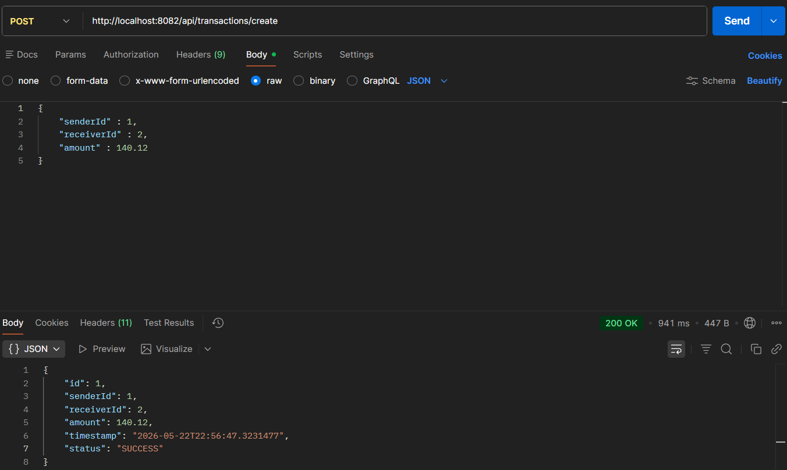
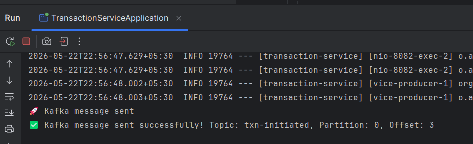

# 💳 PayPal Clone — Microservices Backend

> A scalable, production-inspired payment platform built with Spring Boot microservices architecture.


---

## 📌 Project Status

> **Stage 4 — Kafka Integration (In Progress)**
> This project is under active development. The README is updated alongside each development stage.

| Stage | Milestone | Status |
|-------|-----------|--------|
| 1 | User Service (CRUD + Security Setup) | ✅ Complete |
| 2 | JWT Authentication & Authorization | ✅ Complete |
| 3 | Transaction Service | ✅ Complete |
| 4 | Kafka Event-Driven Messaging | 🔄 In Progress |
| 5 | API Gateway + Service Discovery | 🔜 Upcoming |
| 6 | Wallet & Balance Management | 🔜 Upcoming |
| 7 | Notifications Service | 🔜 Upcoming |
| 8 | Docker & Kubernetes Deployment | 🔜 Upcoming |

---

## Table of Contents

1. [Overview](#1-overview)
2. [Current Microservices](#2-current-microservices)
3. [Architecture](#3-architecture)
4. [Tech Stack](#4-tech-stack)
5. [Folder Structure](#5-folder-structure)
6. [How to Run](#6-how-to-run)
7. [API Endpoints](#7-api-endpoints)
8. [Screenshots](#8-screenshots)
9. [Planned Microservices](#9-planned-microservices)
10. [Contributors](#10-contributors)

---

## 1. Overview

A backend system inspired by PayPal, designed to demonstrate real-world **microservices architecture** using Spring Boot. The platform handles user management, JWT-based authentication, financial transactions, and now **event-driven communication via Apache Kafka** — built with scalability, security, and clean design as core principles.

Each service is independently deployable, loosely coupled, and communicates over REST and Kafka events (with full async messaging expanding in later stages).

---

## 2. Current Microservices

### 👤 User Service *(Stage 1 & 2)*

Handles core user lifecycle management and authentication.

**Stage 1 Features:**
- Create a new user
- Fetch user by ID
- Fetch all users
- Update user details
- Custom exception handling for cleaner error responses
- Spring Security configuration (foundation for JWT)

**Stage 2 Features:**
- Signup API with BCrypt password hashing
- Login API with JWT token generation
- JWT request filter for stateless authentication
- Role-based claims inside JWT payload
- Spring Security context population per request
- Stateless session management

---

### 💸 Transaction Service *(Stage 3 & 4)*

Handles the creation and persistence of financial transactions between users, and publishes transaction events to Kafka.

**Stage 3 Features:**
- `Transaction` entity with fields: `id`, `senderId`, `receiverId`, `amount`, `timestamp`, `status`
- JPA annotations: `@Entity`, `@Table`, `@Id`, `@GeneratedValue`, `@Column`
- Amount validation using `@Positive` with Spring Validation dependency
- Automatic `timestamp` population via `@PrePersist` using `LocalDateTime.now()`
- Default `status` set to `"PENDING"` on pre-persist
- `POST /api/transactions/create` endpoint — creates and persists a transaction, returns full transaction object
- Clean column naming (`sender_id`, `receiver_id`) to accurately reflect stored data
- Hibernate/H2 debugging — traced and fixed `NULL not allowed` constraint violations caused by incorrect getter/setter naming and JSON mapping issues

**Stage 4 Features (Kafka Integration):**
- Docker Compose setup for Zookeeper + Kafka (Confluent images)
- `KafkaEventProducer` component — publishes transaction events to the `transaction-events` topic
- JSON serialization via `JsonSerializer` for structured Kafka messages
- `JacksonConfig` for custom serialization support
- Transaction service wired to publish an event immediately after persisting each transaction
- Verified end-to-end: message appears in Kafka topic on successful transaction creation

---

## 3. Architecture

### JWT Authentication Flow

```
Signup → Store User (BCrypt password)
Login  → Validate credentials → Generate JWT
       → Send JWT in Authorization header
       → JWTRequestFilter validates token
       → Populate SecurityContext
       → Access protected endpoints
```

### Transaction + Kafka Flow *(Stage 4)*

```
POST /api/transactions/create
       ↓
TransactionController
       ↓
TransactionService       → Validates input (amount > 0)
       ↓
@PrePersist              → Sets timestamp = now(), status = "PENDING"
       ↓
TransactionRepository    → Persists to H2
       ↓
KafkaEventProducer       → Publishes event to "transaction-events" topic
       ↓
Response: { id, senderId, receiverId, amount, timestamp, status }
```

### Layered Architecture (Per Service)

```
Client Request
     ↓
Controller Layer      → Handles HTTP requests & responses
     ↓
Service Layer         → Business logic + Kafka event publishing
     ↓
Repository Layer      → Database operations (Spring Data JPA)
     ↓
Database (H2 / MySQL) → Persistence
     ↓
Kafka Broker          → Async event streaming
```

### System Architecture *(Evolves Each Stage)*

```
[Clients]
    ↓
[API Gateway]             ← Stage 5
    ↓
┌──────────────────────────────────────┐
│  User Service      ← Stage 1 ✅      │
│  Auth (JWT)        ← Stage 2 ✅      │
│  Transaction Svc   ← Stage 3 ✅      │
│  Kafka Messaging   ← Stage 4 🔄      │
│  Wallet Service    ← Stage 6         │
│  Notification Svc  ← Stage 7         │
└──────────────────────────────────────┘
    ↓
[Message Broker - Kafka] ← Stage 4 🔄
```

---

## 4. Tech Stack

| Technology | Purpose | Status |
|------------|---------|--------|
| Java 17+ | Core language | ✅ Active |
| Spring Boot 3.x | Application framework | ✅ Active |
| Spring Data JPA | ORM & database operations | ✅ Active |
| Spring Security | Auth & authorization | ✅ Active |
| JJWT 0.12.x | JWT generation & validation | ✅ Active |
| Spring Validation | Request validation (`@Positive`, etc.) | ✅ Active |
| H2 Database | In-memory DB (dev) | ✅ Active |
| BCrypt | Password hashing | ✅ Active |
| Apache Kafka | Async event-driven messaging | ✅ Active |
| Zookeeper | Kafka coordination | ✅ Active |
| Docker Compose | Local Kafka/Zookeeper setup | ✅ Active |
| MySQL / PostgreSQL | Production DB | 🔜 Stage 5+ |
| Maven | Build tool | ✅ Active |
| API Gateway | Routing & load balancing | 🔜 Stage 5 |
| Eureka | Service discovery | 🔜 Stage 5 |
| Docker | Containerization | 🔜 Stage 8 |
| Kubernetes | Orchestration | 🔜 Stage 8 |

---

## 5. Folder Structure

```
paypal-clone/
│
├── assets/                            # Screenshots
│
├── user-service/
│   ├── src/
│   │   ├── main/
│   │   │   ├── java/com/paypal/user_service/
│   │   │   │   ├── controller/        # AuthController, UserController
│   │   │   │   ├── dto/               # JwtResponse, LoginRequest, SignupRequest
│   │   │   │   ├── entity/            # User
│   │   │   │   ├── repository/        # UserRepository
│   │   │   │   ├── security/          # SecurityConfig
│   │   │   │   ├── service/           # UserService, UserServiceImpl
│   │   │   │   └── util/              # JWTUtil, JWTRequestFilter
│   │   │   └── resources/
│   │   │       └── application.properties
│   │   └── test/
│   └── pom.xml
│
├── transaction-service/               ← Stage 3 & 4
│   ├── src/
│   │   ├── main/
│   │   │   ├── java/com/paypal/transaction_service/
│   │   │   │   ├── controller/        # TransactionController
│   │   │   │   ├── entity/            # Transaction
│   │   │   │   ├── kafka/             # KafkaEventProducer
│   │   │   │   ├── config/            # JacksonConfig, SecurityConfig
│   │   │   │   ├── repository/        # TransactionRepository
│   │   │   │   └── service/           # TransactionService, TransactionServiceImpl
│   │   │   └── resources/
│   │   │       └── application.properties
│   │   └── test/
│   └── pom.xml
│
├── docker-compose.yml                 ← Zookeeper + Kafka setup
└── README.md
```

> 📁 Additional service folders will be added as the project progresses through each stage.

---

## 6. How to Run

### Prerequisites

- Java 17+
- Maven 3.8+
- Docker & Docker Compose *(for Kafka)*

### Step 1 — Clone Repository

```bash
git clone https://github.com/ishant212/paypal-clone
cd paypal-clone
```

### Step 2 — Start Kafka & Zookeeper *(Stage 4+)*

```bash
docker-compose up -d
```

This spins up:

- **Zookeeper** on port `2181`
- **Kafka Broker** on port `9092`

```yaml
# docker-compose.yml
services:
  zookeeper:
    image: confluentinc/cp-zookeeper:7.4.1
    ports:
      - "2181:2181"
    environment:
      ZOOKEEPER_CLIENT_PORT: 2181
      ZOOKEEPER_TICK_TIME: 2000

  kafka:
    image: confluentinc/cp-kafka:7.4.1
    ports:
      - "9092:9092"
    environment:
      KAFKA_BROKER_ID: 1
      KAFKA_ZOOKEEPER_CONNECT: zookeeper:2181
      KAFKA_ADVERTISED_LISTENERS: PLAINTEXT://localhost:9092
      KAFKA_LISTENERS: PLAINTEXT://0.0.0.0:9092
      KAFKA_OFFSETS_TOPIC_REPLICATION_FACTOR: 1
    depends_on:
      - zookeeper
```

### Step 3 — Navigate to a Service

```bash
cd user-service
# or
cd transaction-service
```

### Step 4 — Build & Run

```bash
mvn spring-boot:run
```

### Step 5 — Access H2 Console *(Optional)*

```
URL:      http://localhost:8080/h2-console
JDBC URL: jdbc:h2:mem:testdb
Username: sa
Password: (leave blank)
```

> ⚠️ H2 is an in-memory database used for development. Data resets on restart. MySQL/PostgreSQL will be integrated in a later stage.

---

## 7. API Endpoints

### Auth — Base URL: `/auth`

| Method | Endpoint | Description | Auth Required |
|--------|----------|-------------|---------------|
| `POST` | `/auth/signup` | Register a new user | ❌ |
| `POST` | `/auth/login` | Login and receive JWT | ❌ |

### Sample Request — Signup

```json
POST /auth/signup
Content-Type: application/json

{
  "name": "Ishant Shekhar",
  "email": "ishant@example.com",
  "password": "securepassword"
}
```

### Sample Response — Signup

```
User Registration successful
```

### Sample Request — Login

```json
POST /auth/login
Content-Type: application/json

{
  "email": "ishant@example.com",
  "password": "securepassword"
}
```

### Sample Response — Login

```json
{
  "token": "eyJhbGciOiJIUzI1NiJ9.eyJyb2xlIjoiUk9MRV9VU0VSIiwic3ViIjoiaXNoYW50QGV4YW1wbGUuY29tIn0..."
}
```

> Use the returned token as `Authorization: Bearer <token>` in subsequent requests to protected endpoints.

---

### User Service — Base URL: `/api/users`

| Method | Endpoint | Description | Auth Required |
|--------|----------|-------------|---------------|
| `POST` | `/api/users` | Create a new user | ❌ |
| `GET` | `/api/users/{id}` | Fetch user by ID | ✅ |
| `GET` | `/api/users` | Fetch all users | ✅ |

### Sample Request — Create User

```json
POST /api/users
Content-Type: application/json

{
  "name": "Ishant Shekhar",
  "email": "ishant@example.com",
  "password": "securepassword"
}
```

### Sample Response — Create User

```json
{
  "id": 1,
  "name": "Ishant Shekhar",
  "email": "ishant@example.com",
  "createdAt": "2025-01-01T10:00:00"
}
```

---

### Transaction Service — Base URL: `/api/transactions`

| Method | Endpoint | Description | Auth Required |
|--------|----------|-------------|---------------|
| `POST` | `/api/transactions/create` | Create a transaction & publish Kafka event | ✅ |

### Sample Request — Create Transaction

```json
POST /api/transactions/create
Content-Type: application/json

{
  "senderId": 1,
  "receiverId": 2,
  "amount": 140.12
}
```

### Sample Response — Create Transaction

```json
{
  "id": 1,
  "senderId": 1,
  "receiverId": 2,
  "amount": 140.12,
  "timestamp": "2026-05-21T09:43:31.8732542",
  "status": "SUCCESS"
}
```

> On successful creation, a Kafka event is published to the `transaction-events` topic for downstream consumers.

> 📋 Full API documentation (Swagger/OpenAPI) will be added in a future stage.

---

## 8. Screenshots

### 🟢 Signup — POST `/auth/signup`


### 🔵 Login — POST `/auth/login`


### 🟢 Create User — POST `/api/users`


### 🔵 Fetch User by ID — GET `/api/users/{id}`


### 🟡 Fetch All Users — GET `/api/users`


### 🟢 Create Transaction — POST `/api/transactions/create`


### 📨 Kafka Message Published — Terminal Confirmation *(Stage 4)*


---

## 9. Planned Microservices

| Service | Responsibility |
|---------|---------------|
| Wallet Service | Balance management, top-up |
| Notification Service | Email/SMS alerts via Kafka events |
| API Gateway | Centralized routing, rate limiting |

### Next Steps *(Stage 4 → 5)*

- Create consumer services to process `transaction-events` from Kafka
- Implement a balance/wallet service that updates account balances on consumed events
- Add error handling and transaction rollback capabilities (Saga pattern with compensating transactions)
- Add monitoring and structured logging
- Integrate Eureka service discovery and API Gateway (Stage 5)

---
> ⭐ This project is being built stage by stage as a portfolio demonstration of real-world microservices design. Star it to follow along!
